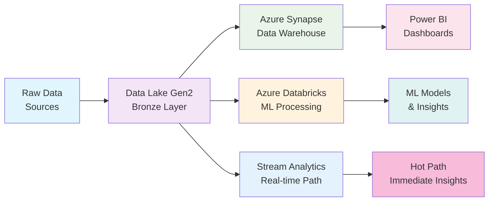
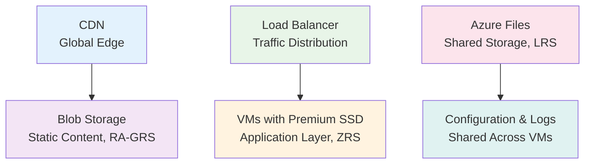
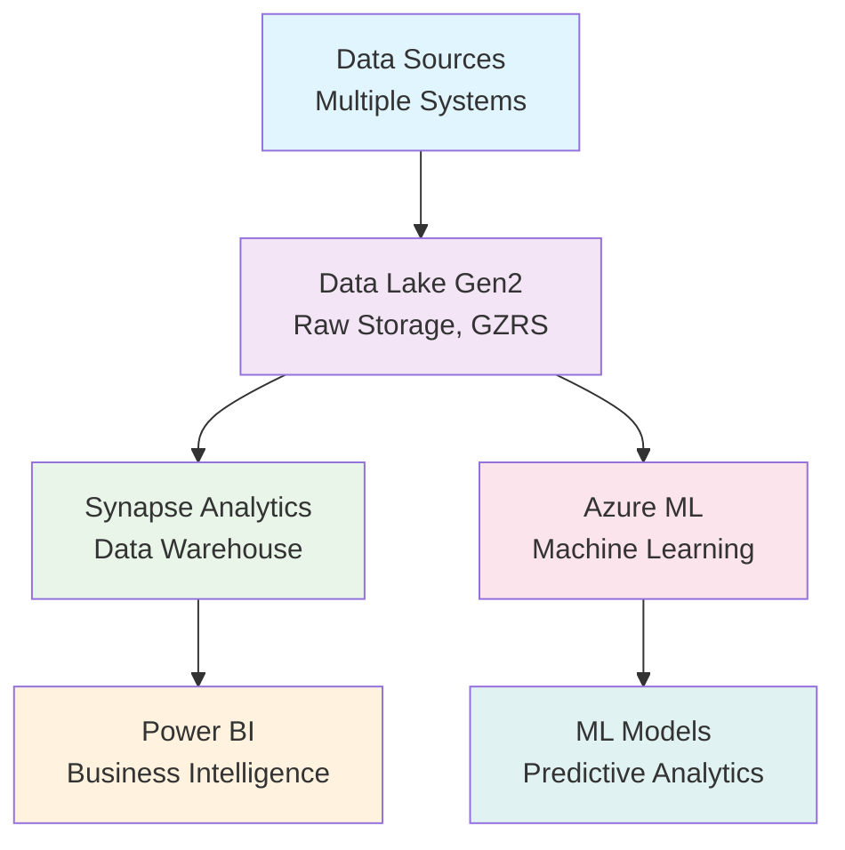
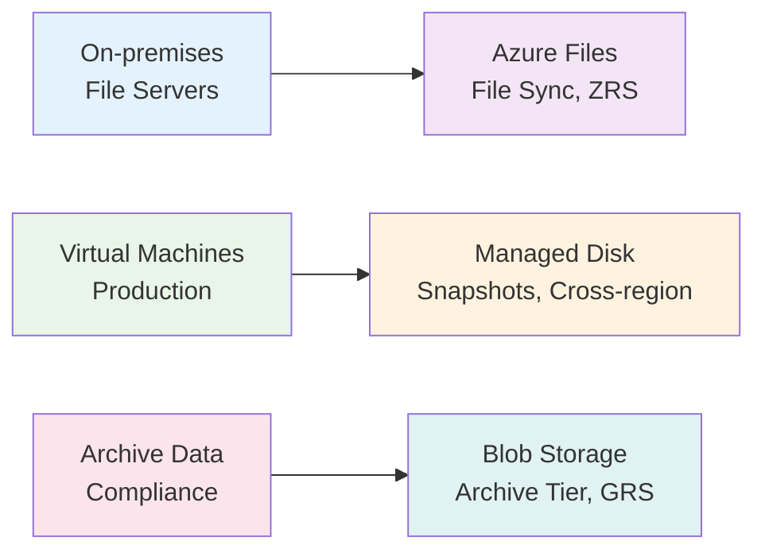
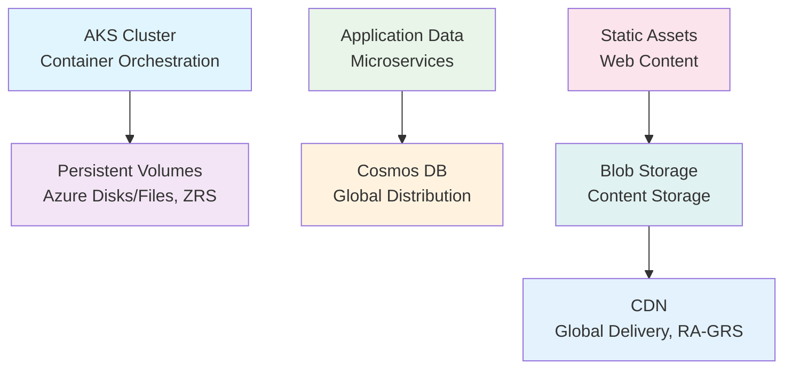

# Azure Storage Services Decision Guide

## 🎯 Quick Overview

| Service | Type | Primary Use | Performance | Cost | Access Pattern |
|---------|------|-------------|-------------|------|----------------|
| **Blob Storage** | Object | Files, backups, media | High | €-€€€ | Web/REST API |
| **Azure Files** | File Share | Shared file systems | Medium | €€ | SMB/NFS |
| **Managed Disks** | Block | VM storage | Very High | €€-€€€ | Direct attach |
| **Data Lake Gen2** | Big Data | Analytics, data lakes | High | €€ | Analytics tools |
| **Queue Storage** | Messaging | Simple messaging | Medium | € | FIFO processing |
| **Table Storage** | NoSQL | Key-value data | Medium | € | Simple queries |

---

## 📁 Blob Storage - The Universal Object Store

### 🎯 When to Choose Blob Storage
- ✅ **Web applications** serving files
- ✅ **Backup and archival** solutions
- ✅ **Media streaming** and CDN content
- ✅ **Data lake** raw storage
- ✅ **Static website** hosting

### 📊 Access Tiers Strategy
- **Hot Tier (€€€):** Frequently accessed data
- **Cool Tier (€€):** Infrequently accessed (30+ days)
- **Archive Tier (€):** Rarely accessed (180+ days)

### **Typical Use Cases**
- **Website images and videos:** Hot tier
- **Monthly reports:** Cool tier
- **Compliance documents:** Archive tier
- **Data lake raw files:** Standard tier
- **Application logs:** Cool/Archive based on retention

### **Performance Tiers**
- **Standard:** General purpose, cost-effective
- **Premium:** High IOPS, low latency, SSD-based

### **Replication Options - Complete Guide**

#### **Local Redundancy Options**
- **LRS (Local Redundant Storage):** 
  - **3 copies** within single datacenter
  - Protects against drive/server failures
  - Lowest cost option
  - Use case: Non-critical data, dev/test environments

#### **Zone Redundancy Options**
- **ZRS (Zone Redundant Storage):**
  - **3 copies** across 3 availability zones in same region
  - Protects against datacenter failures
  - Higher availability than LRS
  - Use case: Applications requiring high availability within region

#### **Geographic Redundancy Options**
- **GRS (Geo Redundant Storage):**
  - **6 copies total:** LRS in primary region (3 copies) + LRS in secondary region (3 copies)
  - Asynchronous replication to secondary region
  - Protects against regional disasters
  - No read access to secondary region unless failover

- **RA-GRS (Read-Access Geo Redundant Storage):**
  - **6 copies total:** Same as GRS + read access to secondary region
  - Enables global read scenarios while maintaining disaster recovery
  - Use case: Applications with global user base needing read access

#### **Premium Redundancy Options**
- **GZRS (Geo-Zone Redundant Storage):**
  - **6 copies total:** ZRS in primary region (3 copies across 3 AZs) + LRS in secondary region (3 copies)
  - Maximum protection: zone redundancy + geographic redundancy
  - Combines high availability with disaster recovery
  - Highest cost but ultimate protection
  - Use case: Mission-critical applications requiring both high availability and disaster recovery

- **RA-GZRS (Read-Access Geo-Zone Redundant Storage):**
  - **6 copies total:** Same as GZRS + read access to secondary region
  - Ultimate protection with global read capability
  - ZRS (primary) + LRS (secondary) + read access
  - Premium pricing for premium protection
  - Use case: Global mission-critical applications

### **Replication Decision Matrix**

| Requirement | Option | Copies | Primary → Secondary | Annual Cost* | RTO/RPO |
|-------------|--------|--------|-------------------|--------------|---------|
| **Cost optimization** | LRS | 3 | Single DC | € | Hours |
| **Regional high availability** | ZRS | 3 | 3 AZs | €€ | Minutes |
| **Disaster recovery** | GRS | 6 | LRS → LRS | €€ | Hours |
| **Global read access** | RA-GRS | 6 | LRS → LRS + Read | €€€ | Minutes/Hours |
| **Mission-critical HA + DR** | GZRS | 6 | ZRS → LRS | €€€€ | Minutes |
| **Global mission-critical** | RA-GZRS | 6 | ZRS → LRS + Read | €€€€€ | Minutes |

*Relative cost indication

### ❌ Avoid When
- Need POSIX file system semantics
- High-frequency small file operations
- Real-time database workloads
- Transactional consistency required

---

## 🗂️ Azure Files - The Cloud File Share

### 🎯 When to Choose Azure Files
- ✅ **Lift-and-shift** scenarios requiring file shares
- ✅ **Shared application** data across VMs
- ✅ **Development tools** and utilities sharing
- ✅ **Backup** of on-premises file servers
- ✅ **Container persistent** volumes

### **Protocol Support**
- **SMB:** Windows-native file sharing
- **NFS:** Linux/Unix file sharing (Premium only)
- **REST API:** Programmatic access

### **Performance Tiers**
- **Standard (Transaction-optimized):** High transaction rates
- **Standard (Hot):** General purpose workloads
- **Standard (Cool):** Archival scenarios  
- **Premium:** High performance, low latency

### **Replication Support**
Azure Files supports the same replication options as Blob Storage:
- **LRS, ZRS** for standard tiers
- **GRS, RA-GRS** for geographic protection
- **GZRS, RA-GZRS** for premium protection (Premium tier)

### **Typical Scenarios**
- **Shared configuration files** across web farm
- **Development tools** accessible by team
- **Home directories** for virtual desktops
- **Application logs** shared storage
- **Container persistent volumes** in AKS

### ❌ Avoid When
- Need block-level access
- High IOPS requirements (use Premium Disks)
- Single VM exclusive access
- Database storage (use Managed Disks)

---

## 💾 Managed Disks - High-Performance Block Storage

### 🎯 When to Choose Managed Disks
- ✅ **Virtual machine** operating systems and data
- ✅ **Database storage** requiring high IOPS
- ✅ **High-performance** applications
- ✅ **Enterprise workloads** with availability SLAs
- ✅ **Disaster recovery** scenarios

### **Disk Types Performance Matrix**
| Disk Type | Max IOPS | Max Throughput | Replication | Use Case |
|-----------|----------|----------------|-------------|----------|
| **Standard HDD** | 2,000 | 500 MB/s | LRS, ZRS | Dev/test, backup |
| **Standard SSD** | 6,000 | 750 MB/s | LRS, ZRS | Web servers, apps |
| **Premium SSD** | 20,000 | 900 MB/s | LRS, ZRS | Production databases |
| **Ultra SSD** | 160,000 | 4,000 MB/s | LRS only | Mission-critical |

### **Replication Strategy for Managed Disks**
- **OS Disks:** LRS recommended (fast local recovery)
- **Data Disks:** 
  - LRS: Cost-effective for non-critical data
  - ZRS: High availability for production workloads
  - Snapshots to different regions for DR

### **Sizing Strategy**
- **OS Disks:** 128 GB minimum (Premium SSD recommended)
- **Data Disks:** Size based on IOPS and throughput requirements
- **Temp Disks:** Use for cache and temporary data only

### **Key Features**
- **Snapshots:** Point-in-time backups with cross-region copy
- **Encryption:** Built-in encryption at rest
- **Availability:** 99.999% SLA for Premium with ZRS
- **Shared Disks:** Multi-attach capability

### ❌ Avoid When
- Need shared access across VMs (use Azure Files)
- Cost optimization is primary concern
- Simple file sharing requirements
- Web-accessible content storage

---

## 🏞️ Data Lake Storage Gen2 - Big Data Analytics

### 🎯 When to Choose Data Lake Gen2
- ✅ **Big data analytics** workloads
- ✅ **Data science** and machine learning
- ✅ **ETL/ELT** data processing pipelines
- ✅ **Data archival** with analytics capabilities
- ✅ **Hierarchical namespace** requirements

### **Architecture Advantages**
**Hierarchical Namespace + Blob Storage = Best of both worlds**
- File system operations (rename, delete directories)
- Blob storage scalability and cost-effectiveness
- Analytics tool compatibility

### **Replication Strategy for Data Lake**
Data Lake Gen2 inherits all Blob Storage replication options:
- **LRS/ZRS:** For cost-sensitive analytics workloads
- **GRS/RA-GRS:** For business-critical data lakes
- **GZRS/RA-GZRS:** For mission-critical analytics platforms

### **Integration Ecosystem**
- **Azure Synapse Analytics:** Native integration
- **Azure Databricks:** Optimized connectors
- **HDInsight:** Hadoop ecosystem support
- **Power BI:** Direct query capabilities

### **Security Features**
- **POSIX ACLs:** Fine-grained permissions
- **Entra ID integration:** Enterprise identity
- **Encryption:** At rest and in transit
- **Private endpoints:** Network isolation

### **Typical Data Pipeline**

### ❌ Avoid When
- Simple file storage needs
- High-frequency transactional operations
- Real-time data access requirements
- Small data volumes (<100 GB)

---

## 📋 Decision Matrix by Scenario

### **Web Applications**
| Requirement | Solution | Replication |
|-------------|----------|-------------|
| **Static content (images, CSS)** | Blob Storage (Hot) + CDN | RA-GRS |
| **User uploads** | Blob Storage (Cool after 30 days) | GRS |
| **Application data** | Managed Disks (Premium SSD) | ZRS |
| **Shared configuration** | Azure Files (Standard) | LRS |

### **Database Workloads**
| Database Type | Storage Solution | Replication |
|---------------|------------------|-------------|
| **SQL Server VMs** | Premium SSD Managed Disks | ZRS |
| **High-IOPS databases** | Ultra SSD | LRS + Backup to GRS |
| **Development databases** | Standard SSD | LRS |
| **Backup storage** | Blob Storage (Cool/Archive) | GRS |

### **Analytics Workloads**
| Data Type | Storage Solution | Replication |
|-----------|------------------|-------------|
| **Raw data ingestion** | Data Lake Gen2 | GZRS |
| **Processed analytics** | Data Lake Gen2 + Synapse | RA-GZRS |
| **Real-time streaming** | Event Hubs → Data Lake Gen2 | GRS |
| **Historical archives** | Blob Storage (Archive) | GRS |

### **Enterprise Applications**
| Scenario | Storage Solution | Replication |
|----------|------------------|-------------|
| **File shares** | Azure Files (Premium for performance) | ZRS |
| **Backup/DR** | Blob Storage (GRS replication) | GZRS |
| **Content distribution** | Blob Storage + CDN | RA-GRS |
| **Log aggregation** | Data Lake Gen2 | GRS |

---

## 💰 Cost Optimization Strategies

### **Lifecycle Management**
**Automatic tier transitions:**
- **Hot → Cool:** After 30 days of no access
- **Cool → Archive:** After 90 days of no access
- **Archive deletion:** After 7 years (compliance)

### **Storage Account Optimization**
- **General Purpose v2:** Best price/performance ratio
- **Block Blob:** Premium for high transaction rates
- **FileStorage:** Premium for high-performance file shares

### **Replication Cost Strategy**
- **Production:** GZRS/RA-GZRS for critical data
- **Staging:** GRS/RA-GRS for important data
- **Development:** ZRS for availability testing
- **Archive:** LRS sufficient for long-term storage

### **Cost Monitoring**
- Use storage analytics to understand access patterns
- Implement lifecycle policies for automatic tiering
- Monitor transactions and bandwidth costs
- Consider reserved capacity for predictable workloads
- Regular review of replication needs vs costs

---

## 🔒 Security Best Practices

### **Access Control**
- **Entra ID integration** for identity-based access
- **Shared Access Signatures (SAS)** for temporary access
- **Stored access policies** for centralized management
- **Private endpoints** for network isolation

### **Encryption Strategy**
- **Encryption at Rest:** Always enabled (Microsoft-managed keys)
- **Customer-managed keys:** For additional control
- **Encryption in transit:** HTTPS/TLS required
- **Client-side encryption:** For sensitive data

### **Network Security**
- **Firewall rules:** Restrict source IP ranges
- **Virtual network service endpoints:** Secure VNet access
- **Private endpoints:** Complete network isolation
- **Disable public access:** For highly sensitive data

### **Replication Security Considerations**
- **Cross-region data sovereignty:** Consider data residency requirements
- **Secondary region access:** Control who can access RA-GRS/RA-GZRS endpoints
- **Failover procedures:** Document and test disaster recovery processes

---

## 🎪 Real-World Architecture Patterns

### **Pattern 1: Modern Web Application**

### **Pattern 2: Data Analytics Platform**

### **Pattern 3: Enterprise Backup Strategy**

### **Pattern 4: Microservices Platform**

---

## 📊 Performance Benchmarking

### **IOPS Requirements Guide**
| Application Type | Recommended IOPS | Disk Type | Replication |
|------------------|------------------|-----------|-------------|
| **Web servers** | 500-2,000 | Standard SSD | ZRS |
| **Databases (OLTP)** | 5,000-20,000 | Premium SSD | ZRS |
| **Analytics (OLAP)** | 2,000-10,000 | Premium SSD | GRS |
| **Mission-critical** | 20,000+ | Ultra SSD | LRS + DR strategy |

### **Throughput Considerations**
- **Sequential workloads:** Prioritize throughput (MB/s)
- **Random workloads:** Prioritize IOPS
- **Mixed workloads:** Balance both metrics

---

## 🚀 Migration Strategies

### **Replication Upgrade Paths**
- **LRS → ZRS:** In-place conversion (some services)
- **LRS → GRS:** Configuration change
- **GRS → GZRS:** Upgrade for premium protection
- **Standard → Premium:** Requires data migration

### **Cross-Region Migration**
- **Azure Data Box:** For large dataset transfers
- **AzCopy:** For programmatic data movement
- **Azure Import/Export:** For massive offline transfers

---

*Choose storage based on access patterns, performance requirements, cost constraints, and protection needs.*
