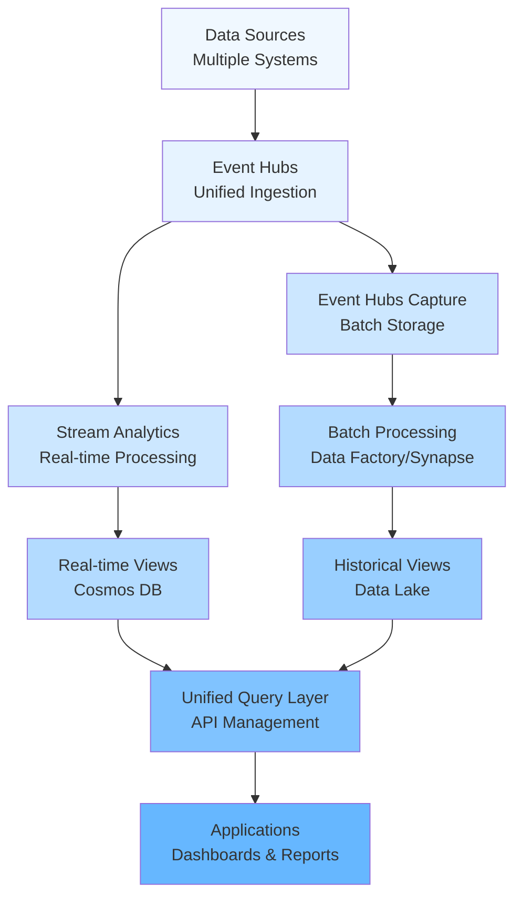
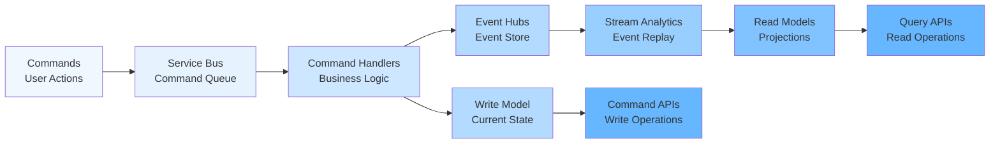
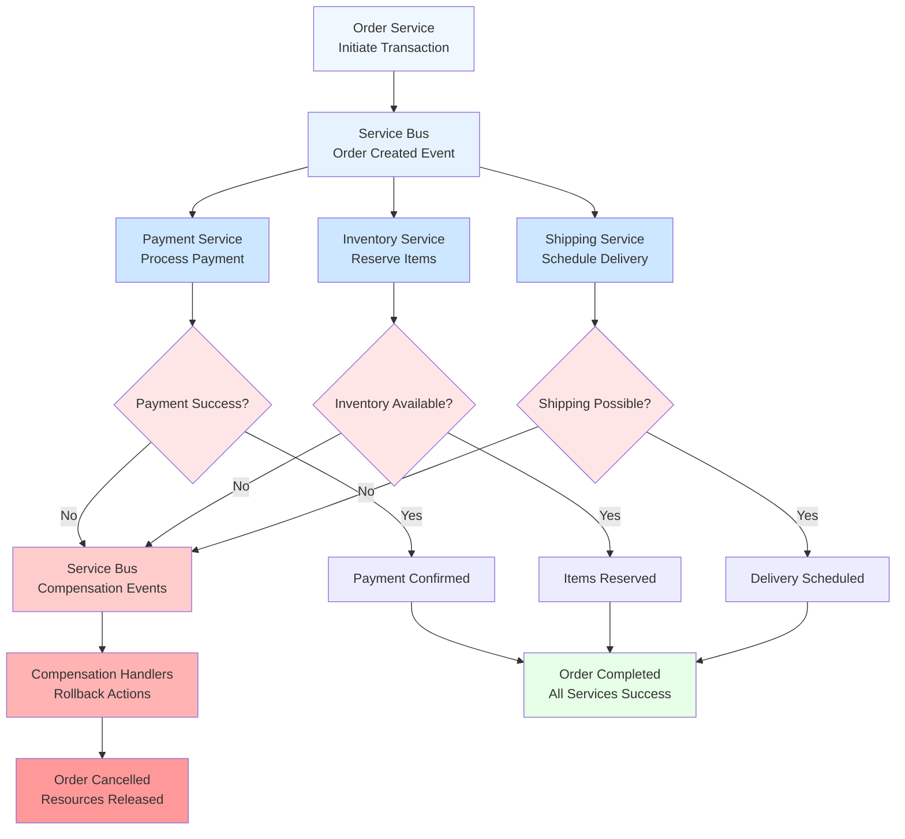
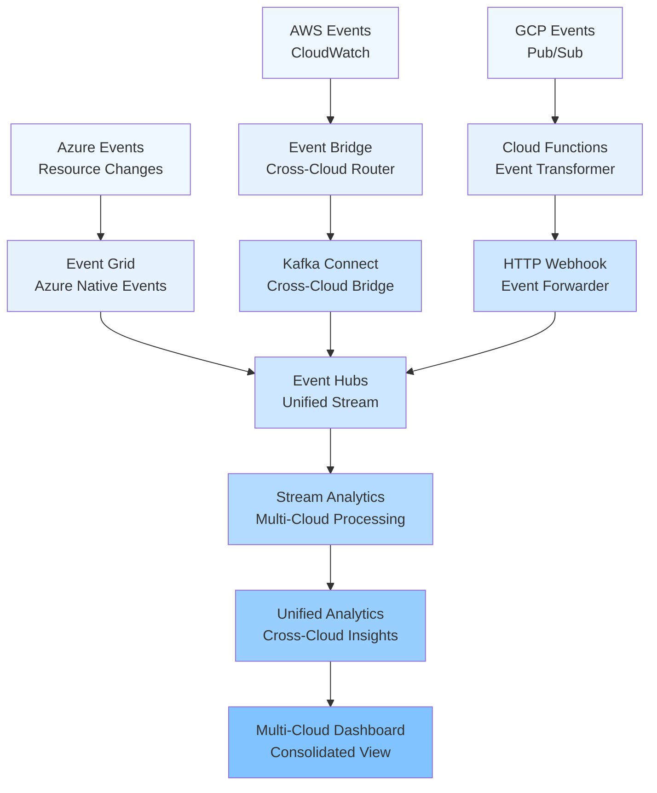
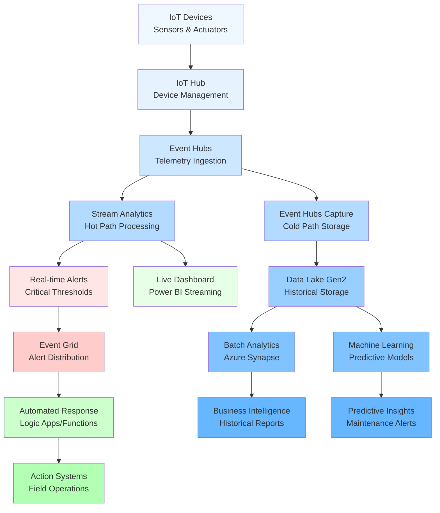

# Azure Messaging & Analytics Decision Guide

## 🎯 Overview

|   Service   |    Type     |   Primary Use   |  Throughput   | Latency |  Key Strength  |
|:-----------:|:-----------:|:---------------:|:-------------:|:-------:|:--------------:|
| **Event Hubs** | Streaming | Massive data ingestion | Very High (1M+/sec) | Real-time | Partition-based streaming |
| **Event Grid** | Routing | Event reaction | High (100K/sec) | Near-instant | Intelligent routing |
| **Stream Analytics** | Processing | Real-time analysis | High | Real-time | SQL on streaming data |
| **Service Bus** | Messaging | Reliable communication | Moderate (10K/sec) | Low | FIFO + Transactions |

---

## 🔄 Event Hubs - The "Big Data Pipe"

### 🎯 When to Choose Event Hubs
- ✅ **Millions of events per second**
- ✅ **Massive IoT telemetry**
- ✅ **Centralized log aggregation**
- ✅ **Data ingestion** for analytics
- ✅ **Stream processing** upstream

### 📊 Typical AZ-305 Use Cases
```
• 100,000 IoT sensors → Event Hubs → Analytics
• Application logs → Event Hubs → Data Lake
• Real-time metrics → Event Hubs → Dashboards
• Gaming telemetry → Event Hubs → ML Pipeline
```

### 🔧 Technical Deep-Dive

#### Partitioning Strategy
- **32 partitions max** per Event Hub
- **Partition key** determines routing
- **Consumer instances** = partition count for max parallelism
- **Ordering** guaranteed within partition only

```
Partition Key Strategy:
• Device ID → Even distribution
• Tenant ID → Tenant isolation
• Random → Load balancing
• Time-based → Hot partitioning (avoid!)
```

#### Throughput Units vs Dedicated Clusters
- **Standard tier**: 1 TU = 1MB/s ingress, 2MB/s egress
- **Dedicated**: Reserved capacity, predictable performance
- **Auto-inflate**: Dynamic scaling up to 20 TUs

#### Event Hubs Capture
```
Event Hubs → Automatic capture → Blob/ADLS
• Avro format for schema evolution
• Time/size-based triggers
• No code required for archival
```

### 🔑 Trigger Keywords
- "Millions of events"
- "IoT telemetry"
- "Big data ingestion"
- "Apache Kafka compatible"
- "Partition-based streaming"
- "Event sourcing"

### ❌ When NOT to Choose Event Hubs
- Bidirectional communication required
- Strict delivery guarantee needed
- Complex event routing
- Low volume (<1000 msg/sec)
- **Anti-pattern**: Synchronous request-response

---

## 📡 Event Grid - The "Smart Router"

### 🎯 When to Choose Event Grid
- ✅ **React to Azure events**
- ✅ **Intelligent event routing**
- ✅ **Serverless architectures**
- ✅ **Event-driven automation**
- ✅ **Multi-service integration**

### 📊 Typical AZ-305 Use Cases
```
• Blob uploaded → Event Grid → Function App
• VM state change → Event Grid → Logic App
• Resource group events → Event Grid → Webhook
• Custom app events → Event Grid → Multiple subscribers
```

### 🔧 Technical Deep-Dive

#### Event Schema Types
- **Event Grid Schema**: Native format
- **CloudEvents Schema**: CNCF standard
- **Custom Schema**: Flexible mapping

#### Delivery Guarantees
- **At-least-once delivery**
- **Retry policy**: Exponential backoff
- **Dead letter queue**: Failed events storage
- **Event TTL**: 24 hours maximum

### 🔑 Trigger Keywords
- "Event-driven"
- "Serverless"
- "Azure resource events"
- "Multiple subscribers"
- "Event routing"
- "Webhook integration"
- "Reactive architecture"

### ❌ When NOT to Choose Event Grid
- Continuous data streaming
- Guaranteed ordering required
- Traditional message queuing
- High-throughput constant streams
- **Anti-pattern**: Complex sequential workflows

---

## 🧮 Stream Analytics - The "Real-Time Processor"

### 🎯 When to Choose Stream Analytics
- ✅ **Real-time analysis** on streams
- ✅ **Data transformation**
- ✅ **Temporal aggregations**
- ✅ **Real-time pattern detection**
- ✅ **SQL-like queries** on streams

### 📊 Typical AZ-305 Use Cases
```
• Event Hubs → Stream Analytics → Power BI
• IoT data → Stream Analytics → Alerts
• Log streams → Stream Analytics → Cosmos DB
• Real-time fraud detection
```

### 🔧 Technical Deep-Dive

#### Scaling Strategy
- **Streaming Units (SUs)**: 1 SU = 1MB/s throughput
- **Partition alignment**: Input partitions = SU count
- **Query parallelization**: PARTITION BY for scale-out

### 🔑 Trigger Keywords
- "Real-time analytics"
- "Stream processing"
- "Aggregation windows"
- "Pattern detection"
- "SQL queries on streams"
- "Temporal functions"

### ❌ When NOT to Choose Stream Analytics
- Batch processing sufficient
- Complex business logic requiring custom code
- Simple message routing
- Pure data ingestion
- **Anti-pattern**: ETL for batch workloads

---

## 🚌 Service Bus - The "Reliable Messenger"

### 🎯 When to Choose Service Bus
- ✅ **Reliable communication** between services
- ✅ **Message queuing** with guarantees
- ✅ **Publish/Subscribe** patterns
- ✅ **Transaction support**
- ✅ **Dead letter queues**

### 📊 Typical AZ-305 Use Cases
```
• Microservices communication
• Order processing workflow
• Decoupling applications
• Reliable command processing
• Enterprise integration patterns
```

### 🔧 Technical Deep-Dive

#### Queues vs Topics
```
Queues (Point-to-Point):
• Single consumer per message
• Competitive consumers pattern
• Load distribution
• FIFO with sessions

Topics (Publish-Subscribe):
• Multiple subscribers per message
• Fan-out messaging
• Content-based routing via filters
• Independent consumer scaling
```

#### Advanced Features
```
Message Sessions:
• FIFO guarantee within session
• Session-aware consumers
• Stateful message processing

Auto-forwarding:
• Chain queues/topics
• Complex routing scenarios
• Dead letter forwarding

Duplicate Detection:
• Time window-based deduplication
• Message fingerprinting
• Exactly-once delivery semantics
```

#### Transaction Support
```csharp
// Transactional message processing
using var scope = new TransactionScope();
await receiver.CompleteMessageAsync(message);
await sender.SendMessageAsync(responseMessage);
scope.Complete();
```

### 🔑 Trigger Keywords
- "Reliable messaging"
- "FIFO ordering"
- "Transactions"
- "Dead letter handling"
- "Enterprise messaging"
- "Decoupling services"
- "Guaranteed delivery"

### ❌ When NOT to Choose Service Bus
- High-volume streaming (>10K msgs/sec)
- Simple event notifications
- Real-time analytics
- IoT telemetry ingestion
- **Anti-pattern**: High-throughput data pipelines

---

## 🚫 Anti-Patterns & Common Mistakes

### Event Hubs Anti-Patterns
❌ **Request-Response Communication**
```
Wrong: Client → Event Hubs → Service → Event Hubs → Client
Right: Client → API Gateway → Service
```

❌ **Small Message Volumes**
```
Wrong: 10 messages/day → Event Hubs
Right: 10 messages/day → Service Bus Queue
```

### Event Grid Anti-Patterns
❌ **Sequential Workflow Orchestration**
```
Wrong: Event Grid for complex multi-step processes
Right: Logic Apps or Durable Functions
```

❌ **High-Volume Streaming**
```
Wrong: Continuous telemetry → Event Grid
Right: Continuous telemetry → Event Hubs
```

### Stream Analytics Anti-Patterns
❌ **Simple Message Routing**
```
Wrong: Stream Analytics for basic filtering
Right: Event Grid with filters
```

❌ **Batch Processing**
```
Wrong: Stream Analytics for nightly ETL
Right: Data Factory pipelines
```

### Service Bus Anti-Patterns
❌ **High-Throughput Streaming**
```
Wrong: Millions of IoT events → Service Bus
Right: Millions of IoT events → Event Hubs
```

❌ **Simple Event Broadcasting**
```
Wrong: Simple notifications → Service Bus Topics
Right: Simple notifications → Event Grid
```

---

## 🎪 Advanced Architecture Patterns

### **Pattern 1: Lambda Architecture**


### **Pattern 2: Event Sourcing + CQRS**


### **Pattern 3: Saga Pattern (Distributed Transactions)**


### **Pattern 4: Multi-Cloud Event Routing**


### **Pattern 5: IoT Analytics Pipeline**


---

## 🔍 Migration Strategies

### From Legacy Messaging Systems

#### IBM MQ → Service Bus
```
Assessment:
• Message patterns (P2P vs Pub/Sub)
• Transaction requirements
• Security models
• Performance baselines

Migration approach:
• Parallel run pattern
• Message bridge during transition
• Gradual consumer migration
```

#### Apache Kafka → Event Hubs
```
Migration tools:
• Kafka Connect with Event Hubs connector
• MirrorMaker for replication
• Schema registry migration

Considerations:
• Consumer offset mapping
• Partition strategy alignment
• Producer configuration changes
```

### From Custom Solutions

#### Polling-based → Event-driven
```
Before: Timer → Database polling → Processing
After: Database → Event Grid → Function → Processing

Benefits:
• Reduced latency
• Lower resource usage
• Better scalability
```

---

## 📊 Monitoring & Troubleshooting

### Key Metrics by Service

#### Event Hubs Monitoring
```
Critical metrics:
• IncomingMessages/OutgoingMessages
• ThrottledRequests (indicates TU limits)
• ConsumerLag (processing delays)
• ArchiveErrors (capture issues)

Common issues:
• Hot partitions → Review partition key strategy
• High latency → Check consumer group scaling
• Throttling → Increase throughput units
```

#### Stream Analytics Monitoring
```
Performance metrics:
• SU Utilization % (should be <80%)
• Watermark Delay (event processing lag)
• Input/Output Events per second
• Runtime Errors

Optimization:
• Partition alignment with input
• Query parallelization
• TEMPORAL JOIN performance
```

#### Service Bus Monitoring
```
Health indicators:
• Active Messages count
• Dead Letter Messages
• Message Lock Duration violations
• Throttling events

Troubleshooting:
• Message loss → Check auto-complete settings
• Processing delays → Scale consumer instances  
• Dead letters → Review message handling logic
```

---

## 💰 Cost Optimization Strategies

### Event Hubs Cost Optimization
```
Strategies:
• Right-size throughput units based on usage patterns
• Use Event Hubs Capture instead of custom consumers
• Implement data retention policies
• Consider dedicated clusters for high-volume scenarios

Monitoring:
• Track throughput unit utilization
• Monitor capture storage costs
• Review partition distribution
```

### Stream Analytics Optimization
```
Performance tuning:
• Optimize query complexity
• Use appropriate windowing functions
• Implement proper partitioning strategy
• Scale streaming units based on demand

Cost management:
• Use consumption-based pricing for variable workloads
• Implement auto-pause for development environments
• Monitor SU utilization and right-size accordingly
```

---

## 🎯 Decision Framework

### 1. **Analyze Volume**
```
High (>1M/sec) → Event Hubs
Medium (1K-1M/sec) → Event Grid or Service Bus
Low (<1K/sec) → Service Bus
```

### 2. **Identify Pattern**
```
Streaming data → Event Hubs
Event notifications → Event Grid
Reliable messaging → Service Bus
Real-time processing → Stream Analytics
```

### 3. **Evaluate Requirements**
```
Ordering required → Service Bus with sessions
Fan-out needed → Event Grid or Service Bus Topics
Analytics needed → Stream Analytics
Archival needed → Event Hubs Capture
```

### Typical Exam Scenarios

#### Scenario 1: IoT Platform
```
Question: "Process 5M IoT sensor readings/hour with real-time 
alerting and historical analysis"

Answer: IoT Hub → Event Hubs → Stream Analytics
        ├── Alerts → Event Grid → Functions
        └── Archive → Event Hubs Capture → Data Lake
```

#### Scenario 2: Microservices Communication
```
Question: "Reliable order processing across 10 microservices 
with transaction support"

Answer: API Gateway → Service Bus Queues → Services
        └── Saga pattern for distributed transactions
```

#### Scenario 3: Event-Driven Architecture
```
Question: "React to Azure resource changes and trigger 
automated workflows"

Answer: Azure Resources → Event Grid → Logic Apps/Functions
```

### Trick Questions to Watch For

#### Volume Mismatches
```
❌ "Process 50M events/day" → Service Bus
✅ "Process 50M events/day" → Event Hubs
(Daily volume can spike during peak hours)
```

#### Latency vs Throughput Confusion
```
❌ "Sub-second response" + "High volume" → Service Bus
✅ "Sub-second response" + "High volume" → Event Hubs + Stream Analytics
```

#### Ordering Requirements
```
❌ Global ordering + High throughput → Event Hubs
✅ Global ordering + High throughput → Service Bus with partitioned entities
```

---

## 🚀 Quick Reference Cards

### Service Selection Matrix
| Requirement | Event Hubs | Event Grid | Stream Analytics | Service Bus |
|:-----------:|:----------:|:----------:|:----------------:|:-----------:|
| **Volume** | 1M+/sec | 100K/sec | Process only | 10K/sec |
| **Ordering** | Per partition | No | No | Global/Session |
| **Delivery** | At least once | At least once | N/A | Exactly once* |
| **Latency** | <100ms | <1s | Real-time | <10ms |
| **Routing** | Partition key | Advanced | N/A | Content-based |
| **Transactions** | No | No | N/A | Yes |

*With sessions and duplicate detection

### Performance Benchmarks
```
Event Hubs:
• Standard: 1 TU = 1,000 events/sec (1KB each)
• Premium: Up to 100MB/sec ingress

Event Grid:
• 5,000 events/sec per topic (normal tier)
• 1,000,000 events/sec (premium tier)

Stream Analytics:
• 1 SU ≈ 1MB/s simple aggregation
• Complex queries reduce throughput 50-80%

Service Bus:
• Standard: ~2,000 msg/sec per queue
• Premium: ~4,000 msg/sec per messaging unit
```

---

## 💡 Final Tips for AZ-305 Success

### Study Approach
1. **Hands-on Practice**: Deploy each service in Azure
2. **Scenario Mapping**: Create mental models for each pattern
3. **Cost Awareness**: Understand pricing implications
4. **Integration Focus**: How services work together

### Common Exam Traps
- Don't choose the "latest and greatest" - choose what fits
- Consider operational complexity, not just features
- Think about the entire data pipeline, not just one component
- Remember compliance and security requirements

### Last-Minute Review
- Memorize throughput limits and key metrics
- Practice drawing architecture diagrams
- Review anti-patterns and when NOT to use each service
- Understand the decision matrices by heart

**Remember**: The AZ-305 tests your ability to design solutions, not just memorize features. Always think about trade-offs, costs, and real-world constraints!
