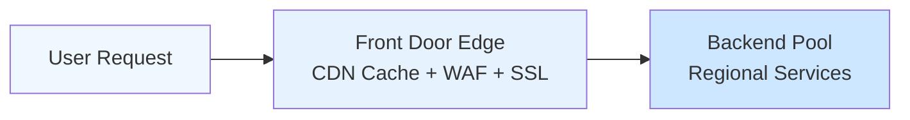
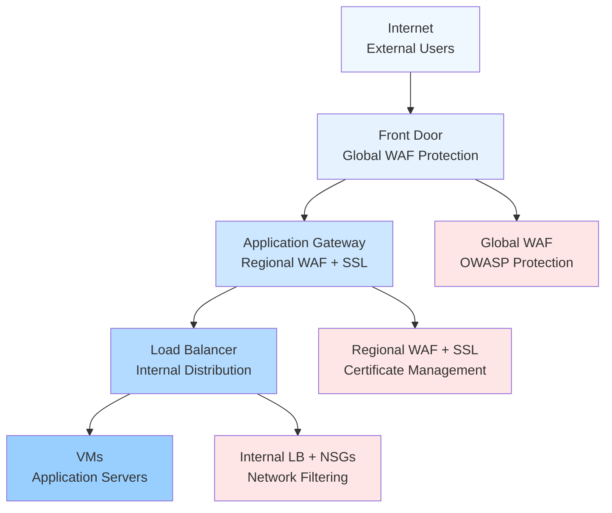
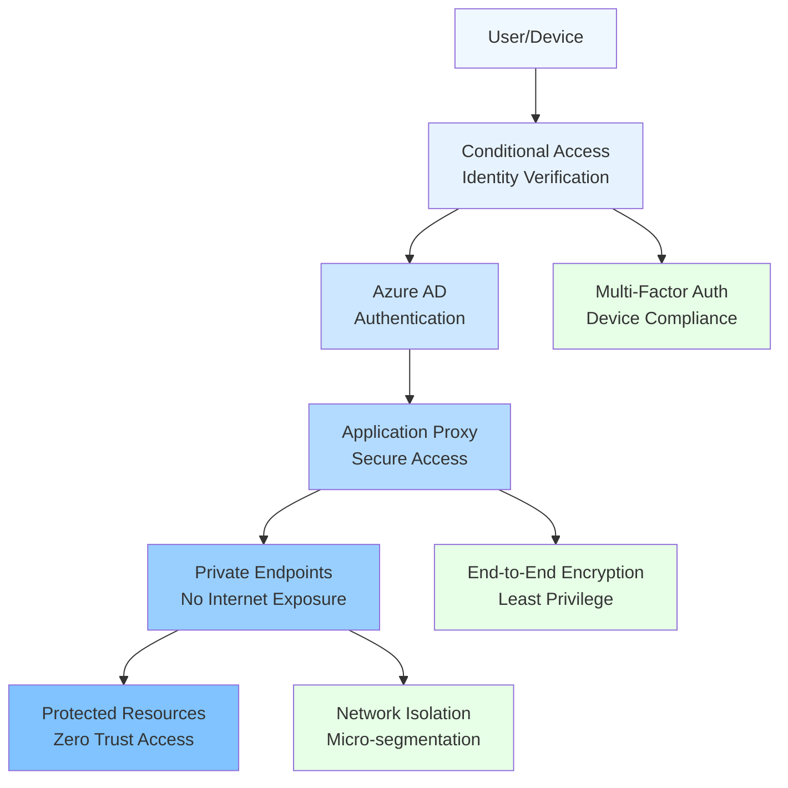
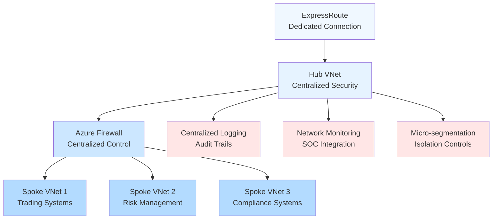
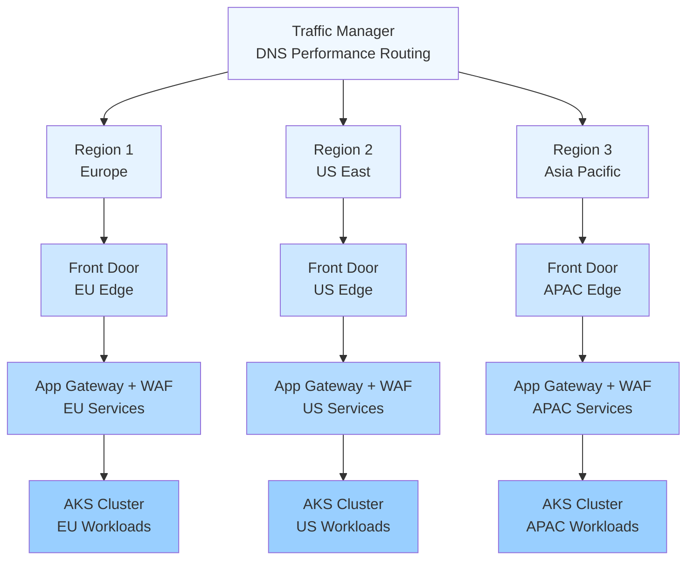
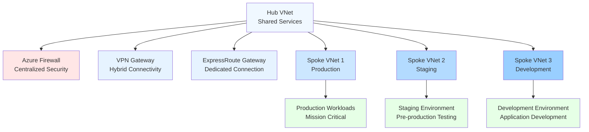
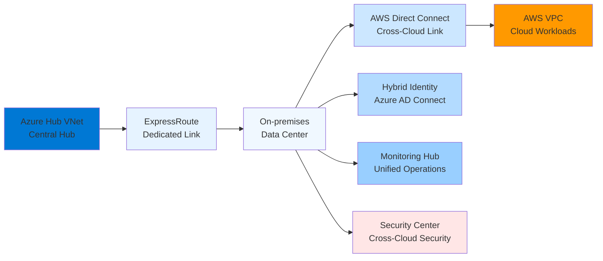

# Azure Networking Decision Guide

## 🎯 Quick Overview

| <center>Service</center> | <center>Purpose</center> | <center>Use Case</center> | <center>Scope</center> | <center>Cost</center> |
|---------|---------|----------|-------|------|
| **Virtual Network (VNet)** | Network isolation | Foundation for all networking | Regional | Free |
| **Application Gateway** | Layer 7 load balancer | Web applications, SSL termination | Regional | €€€ |
| **Azure Load Balancer** | Layer 4 load balancer | VM load balancing | Regional/Global | €€ |
| **Traffic Manager** | DNS-based routing | Global load balancing | Global | € |
| **Front Door** | Global application delivery | CDN + global load balancing | Global | €€€ |
| **VPN Gateway** | Hybrid connectivity | Site-to-site, point-to-site VPN | Regional | €€ |
| **ExpressRoute** | Dedicated connectivity | High-bandwidth hybrid | Regional | €€€€ |

---

## 🌐 Virtual Network (VNet) - Foundation Layer

### 🎯 When to Use VNet
- ✅ **Every Azure deployment** requires a VNet
- ✅ **Network isolation** between environments
- ✅ **Custom IP addressing** requirements
- ✅ **Hybrid connectivity** scenarios
- ✅ **Network security** implementations

### **Core Concepts**
```
VNet (10.0.0.0/16)
├── Subnet 1: Web Tier (10.0.1.0/24)
├── Subnet 2: App Tier (10.0.2.0/24)
└── Subnet 3: Data Tier (10.0.3.0/24)
```

### **VNet Design Patterns**
| <center>Pattern</center> | <center>Description</center> | <center>Use Case</center> |
|---------|-------------|----------|
| **Single VNet** | All resources in one VNet | Simple applications |
| **Hub-Spoke** | Central hub with multiple spokes | Enterprise architecture |
| **Mesh** | Multiple interconnected VNets | Complex distributed systems |

### **Address Space Planning**
```
Production:     10.0.0.0/16  (65,536 IPs)
Staging:        10.1.0.0/16  (65,536 IPs)
Development:    10.2.0.0/16  (65,536 IPs)
```

### **Subnet Strategy**
- **Gateway Subnet:** /27 minimum for VPN Gateway
- **Azure Firewall:** /26 minimum
- **Application Subnets:** /24 typical
- **Database Subnets:** /28 for small deployments

---

## 🔄 Load Balancing Services

### **Azure Load Balancer (Layer 4)**
**When to choose:**
- ✅ **VM-to-VM** load balancing
- ✅ **High-performance** requirements
- ✅ **TCP/UDP** protocols
- ✅ **Internal** load balancing
- ✅ **Cost-effective** solution

**SKUs and Features:**
```
Basic SKU:
- Up to 300 instances
- Availability Set support
- No SLA

Standard SKU:
- Up to 1000 instances
- Availability Zone support
- 99.99% SLA
- Health probes
```

**Load Balancing Rules:**
- **Frontend IP:** Public or private IP
- **Backend Pool:** Target VMs or VM Scale Sets
- **Health Probe:** TCP, HTTP, or HTTPS
- **Session Persistence:** Client IP, Client IP and protocol

---

### **Application Gateway (Layer 7)**
**When to choose:**
- ✅ **HTTP/HTTPS** applications
- ✅ **SSL termination** required
- ✅ **URL-based routing** needed
- ✅ **Web Application Firewall** (WAF)
- ✅ **Cookie-based** session affinity

**Key Features:**
```
SSL Termination: Offload SSL processing
URL Routing: Route based on URL path
Host Routing: Multiple sites on same gateway
WAF: Protection against OWASP Top 10
Autoscaling: Scale based on demand
```

**Routing Examples:**
```
contoso.com/images/* → Image server pool
contoso.com/api/*    → API server pool
contoso.com/*        → Web server pool
```

---

### **Traffic Manager (DNS-based)**
**When to choose:**
- ✅ **Global** load balancing
- ✅ **DNS-based** routing
- ✅ **Cross-region** failover
- ✅ **Cost-effective** global solution
- ✅ **Multiple protocols** support

**Routing Methods:**
| <center>Method</center> | <center>Description</center> | <center>Use Case</center> |
|--------|-------------|----------|
| **Priority** | Primary/backup failover | Disaster recovery |
| **Weighted** | Traffic distribution | A/B testing |
| **Performance** | Lowest latency | Global applications |
| **Geographic** | Geographic routing | Compliance requirements |

---

### **Azure Front Door (CDN + Global LB)**
**When to choose:**
- ✅ **Global web** applications
- ✅ **CDN** functionality required
- ✅ **SSL termination** at edge
- ✅ **Advanced routing** rules
- ✅ **DDoS protection** needed

**Architecture Benefits:**


**Advanced Features:**
- **Session Affinity:** Sticky sessions
- **Custom Domains:** Bring your own domain
- **Rules Engine:** Complex routing logic
- **Real-time Metrics:** Performance monitoring

---

## 🔗 Hybrid Connectivity

### **VPN Gateway**
**When to choose:**
- ✅ **Site-to-Site** VPN connections
- ✅ **Point-to-Site** remote access
- ✅ **VNet-to-VNet** connections
- ✅ **Budget-conscious** hybrid connectivity
- ✅ **Encrypted** internet-based connections

**Gateway SKUs:**
| <center>SKU</center> | <center>Bandwidth</center> | <center>Tunnels</center> | <center>BGP</center> |
|-----|-----------|---------|-----|
| **Basic** | 100 Mbps | 10 | No |
| **VpnGw1** | 650 Mbps | 30 | Yes |
| **VpnGw2** | 1 Gbps | 30 | Yes |
| **VpnGw3** | 1.25 Gbps | 30 | Yes |

**Configuration Types:**
```
Policy-based: Static routing, single tunnel
Route-based: Dynamic routing, multiple tunnels
```

---

### **ExpressRoute**
**When to choose:**
- ✅ **High-bandwidth** requirements (>1 Gbps)
- ✅ **Predictable performance** needed
- ✅ **Private connectivity** required
- ✅ **Mission-critical** applications
- ✅ **Compliance** mandates private connection

**Circuit Types:**
```
Local: Up to 10 Gbps in metro area
Standard: Global connectivity
Premium: Global + Office 365 optimized
```

**Bandwidth Options:**
- **50 Mbps to 10 Gbps** standard circuits
- **100 Gbps** for ExpressRoute Direct

**Peering Types:**
- **Private Peering:** Azure VNets
- **Microsoft Peering:** Office 365, Azure PaaS

---

## 🎯 Decision Framework by Scenario

### **Web Application Architecture**
| <center>Component</center> | <center>Service</center> | <center>Purpose</center> |
|-----------|---------|---------|
| **Global Entry** | Front Door | CDN + Global LB + WAF |
| **Regional LB** | Application Gateway | SSL termination + L7 routing |
| **Internal LB** | Load Balancer | Backend service distribution |

### **Multi-Region Setup**
```
Traffic Manager (DNS routing)
├── Region 1: Application Gateway → VM Scale Set
├── Region 2: Application Gateway → VM Scale Set
└── Region 3: Application Gateway → VM Scale Set
```

### **Hybrid Enterprise**
```
On-premises ←→ ExpressRoute ←→ Hub VNet
                                 ├── Spoke VNet 1 (Production)
                                 ├── Spoke VNet 2 (Staging)
                                 └── Spoke VNet 3 (Development)
```

### **Microservices Platform**
```
External: Front Door → Application Gateway
Internal: Service Mesh (Istio) or Internal Load Balancer
Backend: Azure Load Balancer for databases
```

---

## 🔒 Network Security

### **Network Security Groups (NSG)**
**Rule Priority:** 100-4096 (lower number = higher priority)
```
Priority 100: Allow HTTPS inbound from Internet
Priority 200: Allow SSH from management subnet
Priority 300: Deny all other inbound traffic
```

**Common Patterns:**
```
Web Tier NSG:
- Allow 80/443 from Internet
- Allow 22/3389 from management subnet
- Deny all other inbound

App Tier NSG:
- Allow application ports from web tier
- Allow monitoring from management subnet
- Deny all other inbound
```

### **Azure Firewall**
**When to choose:**
- ✅ **Centralized** network security
- ✅ **Application** and network rules
- ✅ **FQDN filtering** required
- ✅ **Threat intelligence** integration
- ✅ **Hub-spoke** architecture

**Rule Types:**
- **Network Rules:** IP, port, protocol
- **Application Rules:** FQDN, HTTP/HTTPS
- **NAT Rules:** DNAT for inbound traffic

### **Web Application Firewall (WAF)**
**Protection Against:**
- SQL injection
- Cross-site scripting (XSS)
- DDoS attacks
- Bot protection
- OWASP Top 10 vulnerabilities

**Deployment Options:**
- **Application Gateway WAF:** Regional protection
- **Front Door WAF:** Global protection
- **Azure Firewall Premium:** Network + application

---

## 💰 Cost Optimization

### **Load Balancer Cost Comparison**
| <center>Service</center> | <center>Base Cost</center> | <center>Data Processing</center> | <center>Use Case</center> |
|---------|-----------|----------------|----------|
| **Load Balancer** | € | Low | Cost-effective VM LB |
| **Application Gateway** | €€€ | Medium | Feature-rich web apps |
| **Traffic Manager** | € | Per query | Global DNS routing |
| **Front Door** | €€€ | High | Premium global apps |

### **Optimization Strategies**
```
Development: Use basic SKUs where possible
Staging: Standard SKUs for testing
Production: Premium SKUs for performance and SLA
```

### **Traffic Patterns**
- **Predictable traffic:** Reserved capacity discounts
- **Variable traffic:** Pay-as-you-go pricing
- **Global traffic:** Consider Front Door vs Traffic Manager costs

---

## 📊 Performance Guidelines

### **Latency Expectations**
| <center>Service</center> | <center>Typical Latency</center> | <center>Use Case</center> |
|---------|----------------|----------|
| **Load Balancer** | <1ms | Internal traffic |
| **Application Gateway** | 2-5ms | SSL termination |
| **Traffic Manager** | DNS resolution time | Global routing |
| **Front Door** | Edge location + 2-10ms | Global CDN |

### **Bandwidth Considerations**
```
VPN Gateway: Up to 1.25 Gbps (VpnGw3)
ExpressRoute: Up to 100 Gbps (Direct)
Application Gateway: Up to 125 Mbps per instance
Load Balancer: No bandwidth limits
```

### **Scaling Limits**
| <center>Service</center> | <center>Maximum</center> | <center>Notes</center> |
|---------|---------|-------|
| **VMs per Load Balancer** | 1,000 | Standard SKU |
| **Rules per NSG** | 1,000 | Per NSG |
| **Application Gateway instances** | 125 | With autoscaling |
| **Front Door backends** | 500 | Per backend pool |

---

## 🎪 Advanced Scenarios

### **Multi-Tier Application Security**


### **Zero-Trust Network Architecture**


### **Financial Services Compliance**


### **Disaster Recovery Setup**
```
Primary Region:   Production workloads
Secondary Region: Warm standby
Traffic Manager:  Automatic failover routing
```

---

## 🌍 Global Architecture Patterns

### **Pattern 1: Global E-commerce Platform**


### **Pattern 2: Hub-Spoke Enterprise**


### **Pattern 3: Multi-Cloud Connectivity**


---

## 🔐 Advanced Security Patterns

### **Zero-Trust Network Implementation**
```yaml
Network Segmentation:
├── External perimeter (Front Door + WAF)
├── Internal perimeter (Application Gateway)
├── Workload perimeter (NSGs + Private Endpoints)
└── Data perimeter (Private Link + Encryption)

Identity-based Access:
├── User identity (Azure AD + Conditional Access)
├── Device identity (Device compliance)
├── Application identity (Managed Identity)
└── Service identity (Service Principals)

Continuous Monitoring:
├── Traffic analysis (NSG Flow Logs)
├── Threat detection (Azure Sentinel)
├── Compliance monitoring (Azure Policy)
└── Performance monitoring (Azure Monitor)
```

### **Financial Services Network Security**
```yaml
Perimeter Security:
- DDoS Protection Standard on all public IPs
- WAF with OWASP Core Rule Set + custom rules
- Rate limiting and geo-blocking
- Bot protection and behavioral analysis

Internal Security:
- Network segmentation with NSGs
- Private endpoints for all PaaS services
- Service endpoints where private endpoints not available
- No direct internet access for backend services

Data Protection:
- All traffic encrypted in transit (TLS 1.3)
- Private connectivity for sensitive data flows
- Network isolation for compliance zones
- Audit logging for all network access

Monitoring and Response:
- 24/7 SOC monitoring
- Automated incident response
- Network forensics capabilities
- Compliance reporting automation
```

---

## 💰 Advanced Cost Optimization

### **Network Cost Breakdown Analysis**
```yaml
Typical Monthly Costs (Enterprise):
ExpressRoute (1 Gbps): €2,000
- Circuit cost: €1,500
- Outbound data transfer: €300
- Redundant circuit: €200

Application Gateway: €800
- Gateway hours: €500
- Data processing: €200
- WAF processing: €100

Azure Firewall: €1,200
- Deployment cost: €900
- Data processing: €300

Load Balancer: €200
- Standard LB: €150
- Data processing: €50

VPN Gateway: €300
- Gateway cost: €250
- Data transfer: €50

Total: €4,500/month
```

### **Cost Optimization Strategies**
```yaml
ExpressRoute Optimization:
- Right-size circuits based on actual usage
- Use ExpressRoute Local for same-metro connectivity
- Implement BGP communities for traffic engineering
- Consider ExpressRoute FastPath for high-performance

Application Gateway Optimization:
- Use v2 SKU for auto-scaling capabilities
- Implement connection draining for cost efficiency
- Optimize SSL certificate management
- Use managed rules for WAF to reduce management overhead

Data Transfer Optimization:
- Minimize cross-region traffic
- Use Azure CDN for static content
- Implement data compression
- Optimize application protocols

Architecture Optimization:
- Consolidate services where possible
- Use hub-spoke to reduce gateway costs
- Implement traffic engineering for optimal routing
- Regular review of network utilization patterns
```

---

## 🚀 Emerging Technologies and Future Patterns

### **Azure Virtual WAN Integration**
```yaml
Virtual WAN Benefits:
- Simplified branch connectivity
- Optimized routing through Microsoft backbone
- Integrated security through Azure Firewall Manager
- Global transit network architecture

Use Cases:
- Large enterprises with multiple branches
- Global organizations requiring optimized connectivity
- Organizations wanting to simplify network management
- Hybrid and multi-cloud connectivity scenarios

Migration Strategy:
- Assess current hub-spoke architecture
- Plan Virtual WAN implementation phases
- Test connectivity and performance
- Migrate workloads systematically
```

### **Azure Private 5G Core**
```yaml
Industrial Applications:
- Manufacturing facilities requiring ultra-low latency
- Healthcare environments with mobility requirements
- Retail locations with high-density device connectivity
- Transportation hubs requiring reliable connectivity

Integration with Azure Services:
- Edge computing with Azure Stack Edge
- IoT device management through IoT Hub
- AI/ML processing at the edge
- Hybrid cloud connectivity patterns

Security Considerations:
- Network slicing for traffic isolation
- Identity-based access control
- Encryption for all communications
- Integration with Zero Trust architecture
```

### **Network Function Virtualization (NFV)**
```yaml
Azure Network Function Manager:
- Virtualized network functions deployment
- Service chaining and traffic steering
- Centralized management and orchestration
- Integration with existing network infrastructure

Common Virtual Network Functions:
- Virtual firewalls (Palo Alto, Fortinet)
- Virtual load balancers (F5, Citrix)
- Virtual WAN optimization (Silver Peak)
- Virtual security appliances (Check Point)

Benefits:
- Reduced hardware dependency
- Simplified deployment and management
- Improved scalability and flexibility
- Cost optimization through virtualization
```

---

## 📊 Network Performance Optimization

### **Latency Optimization Techniques**
```yaml
Geographic Optimization:
- Deploy resources close to users
- Use Azure regions with lowest latency
- Implement edge computing scenarios
- Optimize DNS resolution with Traffic Manager

Protocol Optimization:
- Use HTTP/2 and HTTP/3 where supported
- Implement connection pooling
- Optimize TCP window sizes
- Use WebSocket for real-time applications

Application Optimization:
- Implement caching strategies
- Use CDN for static content delivery
- Optimize database query patterns
- Implement asynchronous processing
```

### **Bandwidth Optimization**
```yaml
Traffic Engineering:
- Implement QoS policies for critical traffic
- Use traffic shaping for non-critical applications
- Optimize routing policies with BGP
- Monitor and analyze traffic patterns

Compression and Acceleration:
- Enable compression at application layer
- Use WAN optimization appliances
- Implement data deduplication
- Optimize payload sizes

Network Design:
- Right-size network connections
- Implement redundant paths for load distribution
- Use multipath protocols where appropriate
- Regular capacity planning and upgrades
```

---

## 🔧 Troubleshooting Common Issues

### **Connectivity Problems**
1. **Check NSG rules:** Ensure required ports are open
2. **Verify routing:** Check route tables and UDRs
3. **Test DNS resolution:** Ensure name resolution works
4. **Check service health:** Verify backend health probes

### **Performance Issues**
1. **Monitor metrics:** Use Azure Monitor for insights
2. **Check bandwidth:** Verify network throughput limits
3. **Optimize routing:** Use performance routing in Traffic Manager
4. **Scale resources:** Add more instances or upgrade SKUs

### **Security Concerns**
1. **Enable NSG flow logs:** Monitor traffic patterns
2. **Use Azure Firewall logs:** Centralized security monitoring
3. **Implement WAF:** Protect against application attacks
4. **Monitor DDoS:** Enable DDoS protection for public IPs

---

## 🎯 Implementation Best Practices

### **Design Principles**
```yaml
Security by Design:
- Implement defense in depth
- Use principle of least privilege
- Encrypt all communications
- Monitor and log all network activity

Scalability Planning:
- Design for growth from day one
- Use auto-scaling where possible
- Plan for geographic expansion
- Consider performance at scale

Resilience and Reliability:
- Implement redundancy at multiple levels
- Plan for disaster recovery scenarios
- Test failover procedures regularly
- Monitor health and performance continuously

Cost Consciousness:
- Implement FinOps practices for network services
- Regular cost reviews and optimization
- Use reserved capacity for predictable workloads
- Monitor and optimize data transfer costs
```

### **Operational Excellence**
```yaml
Monitoring and Alerting:
- Comprehensive network monitoring
- Proactive alerting for issues
- Performance baseline establishment
- Capacity planning based on trends

Documentation and Procedures:
- Network architecture documentation
- Incident response procedures
- Change management processes
- Regular architecture reviews

Team Skills and Training:
- Azure networking certification
- Security best practices training
- Troubleshooting skills development
- Continuous learning culture
```

---

*Design your network architecture for security, performance, and cost optimization from the ground up.*
