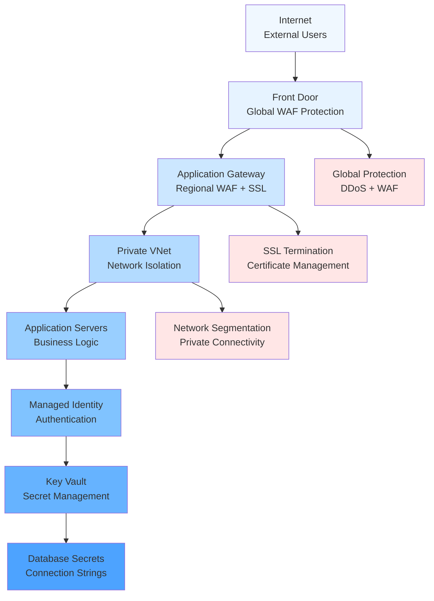
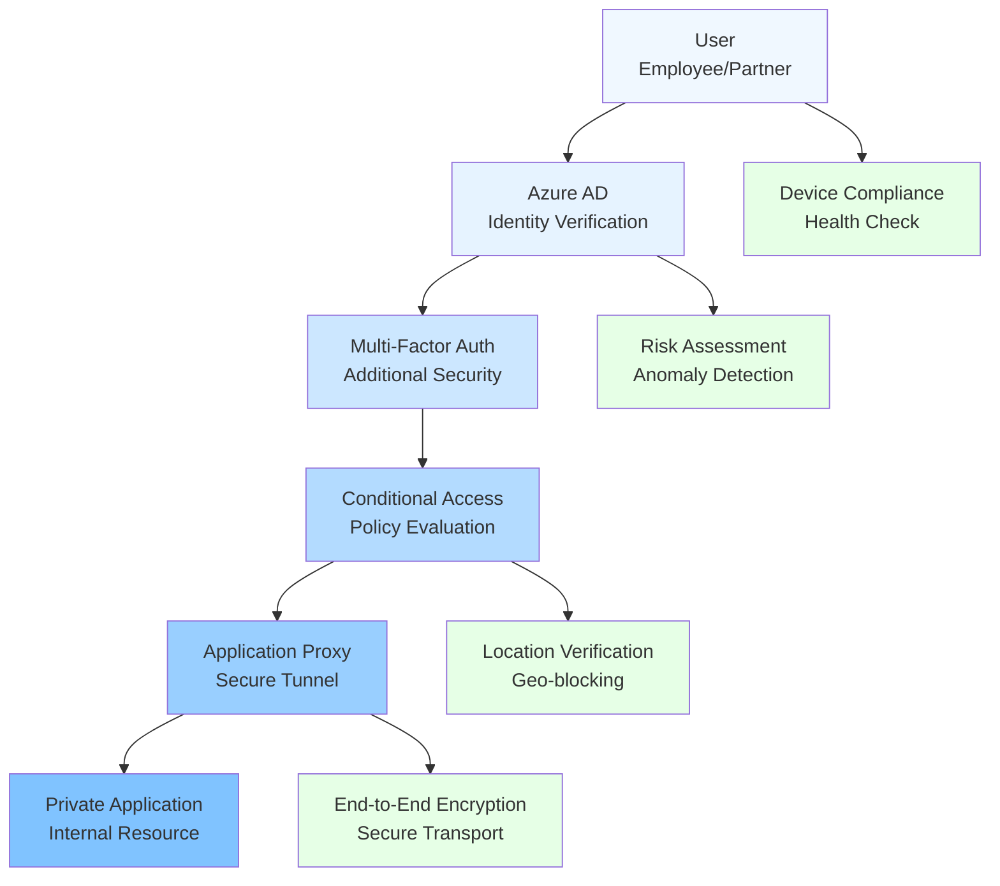
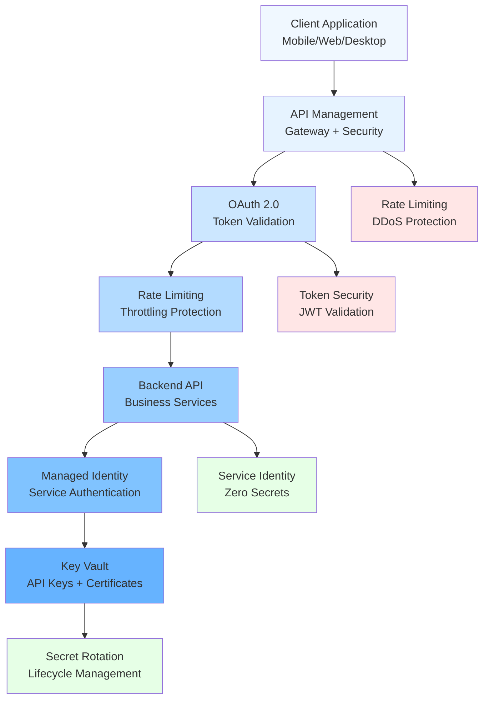
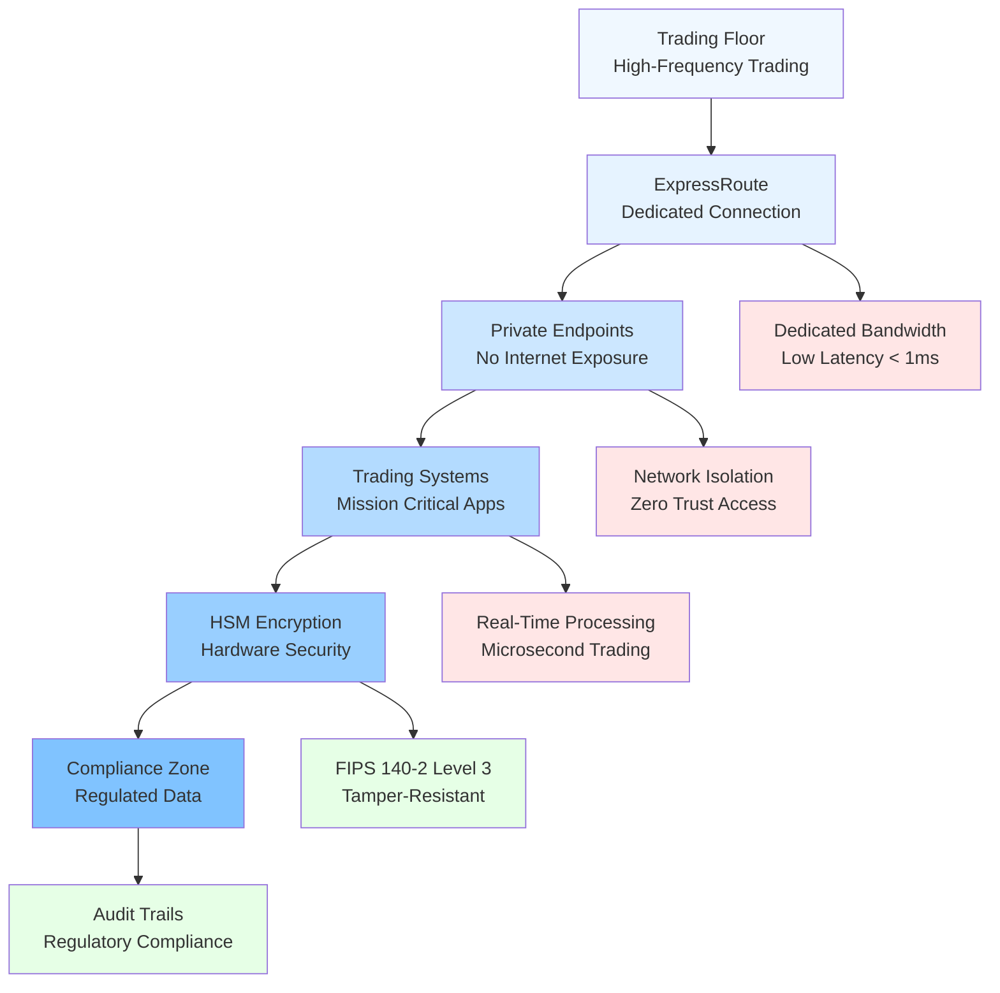

# Azure Security & Identity Decision Guide

## 🎯 Quick Overview

| <div style="text-align: center">Service</div> | <div style="text-align: center">Purpose</div> | <div style="text-align: center">Use Case</div> | <div style="text-align: center">Complexity</div> | <div style="text-align: center">Cost</div> |
|---------|---------|----------|------------|------|
| **Azure Active Directory** | Identity & Access | User authentication, SSO | Medium | €€ |
| **Key Vault** | Secret management | Keys, certificates, secrets | Low | € |
| **Azure Sentinel** | SIEM/SOAR | Security monitoring, threat detection | High | €€€ |
| **Security Center/Defender** | Security posture | Vulnerability assessment, compliance | Medium | €€ |
| **Application Gateway WAF** | Web protection | Web application firewall | Low | €€ |
| **Azure Firewall** | Network security | Centralized network protection | Medium | €€€ |
| **Private Link/Endpoint** | Network isolation | Private connectivity to services | Low | €€ |

---

## 🔍 Azure Active Directory (Azure AD) - Identity Foundation

### 🎯 When to Choose Azure AD
- ✅ **Enterprise identity** management
- ✅ **Single Sign-On (SSO)** across applications
- ✅ **Multi-factor authentication** (MFA)
- ✅ **Conditional access** policies
- ✅ **B2B/B2C** scenarios

### **Edition Comparison**
| <div style="text-align: center">Feature</div> | <div style="text-align: center">Free</div> | <div style="text-align: center">Premium P1</div> | <div style="text-align: center">Premium P2</div> |
|---------|------|------------|------------|
| **Users** | 500K | Unlimited | Unlimited |
| **SSO Apps** | 10 | Unlimited | Unlimited |
| **MFA** | Basic | Advanced | Advanced |
| **Conditional Access** | ❌ | ✅ | ✅ |
| **Identity Protection** | ❌ | ❌ | ✅ |
| **PIM** | ❌ | ❌ | ✅ |

### **Authentication Methods**
```
Password + MFA:           Basic security
Passwordless (Windows Hello): Enhanced UX
FIDO2 Security Keys:      Highest security
Certificate-based:       Enterprise scenarios
```

### **Conditional Access Policies**
```
Policy Components:
├── Users/Groups: Who the policy applies to
├── Cloud Apps: Which applications
├── Conditions: Device, location, risk
└── Access Controls: Grant, block, require MFA
```

### **Common Patterns**
```
Internal Users: Azure AD + MFA + Conditional Access
External Partners: B2B guest access + MFA
Customers: Azure AD B2C + social identity
Applications: Service principals + managed identity
```

---

## 🔑 Azure Key Vault - Secret Management

### 🎯 When to Choose Key Vault
- ✅ **Centralized secret** management
- ✅ **Certificate lifecycle** management
- ✅ **Hardware Security Module (HSM)** requirements
- ✅ **Application security** for API keys, connection strings
- ✅ **Compliance** requirements for key management

### **Object Types**
| <div style="text-align: center">Type</div> | <div style="text-align: center">Use Case</div> | <div style="text-align: center">Examples</div> |
|------|----------|----------|
| **Secrets** | Text-based secrets | Connection strings, API keys |
| **Keys** | Cryptographic keys | Encryption, signing keys |
| **Certificates** | X.509 certificates | SSL/TLS, client auth |

### **Access Control Models**
```
Vault Access Policy (Legacy):
- Principal-based permissions
- Object-type specific permissions

Azure RBAC (Recommended):
- Fine-grained role assignments
- Consistent with Azure governance
```

### **Integration Patterns**
```
Applications:
- Managed Identity → Key Vault → Secrets
- No credentials in code or config

DevOps:
- Azure Pipelines → Key Vault → Deployment secrets
- Secure CI/CD processes

Infrastructure:
- ARM Templates → Key Vault → Secure parameters
```

### **Key Vault Tiers**
| <div style="text-align: center">Feature</div> | <div style="text-align: center">Standard</div> | <div style="text-align: center">Premium</div> |
|---------|----------|---------|
| **Software Keys** | ✅ | ✅ |
| **HSM-backed Keys** | ❌ | ✅ |
| **Price** | € | €€€ |
| **FIPS 140-2 Level** | 1 | 2 |

---

## 🛡️ Azure Security Center/Defender - Security Posture

### 🎯 When to Choose Defender for Cloud
- ✅ **Security posture** assessment
- ✅ **Vulnerability management**
- ✅ **Compliance** monitoring
- ✅ **Threat protection** across workloads
- ✅ **Multi-cloud** security management

### **Defender Plans**
| <div style="text-align: center">Workload</div> | <div style="text-align: center">Protection</div> | <div style="text-align: center">Key Features</div> |
|----------|------------|--------------|
| **Servers** | VMs, Azure Arc | Vulnerability assessment, just-in-time access |
| **App Service** | Web apps | Runtime threat detection |
| **Storage** | Blob, Files | Malware scanning, sensitive data discovery |
| **SQL** | Databases | Vulnerability assessment, threat detection |
| **Kubernetes** | AKS, Arc | Runtime protection, admission control |
| **Container Registries** | ACR | Image vulnerability scanning |

### **Security Score**
```
Calculation: (Completed recommendations / Total recommendations) × 100
- Provides actionable security improvements
- Tracks progress over time
- Benchmarks against industry standards
```

### **Compliance Frameworks**
- **Azure Security Benchmark:** Microsoft's baseline
- **PCI DSS:** Payment card industry
- **SOC TSP:** Service organization controls
- **ISO 27001:** International security standard
- **HIPAA:** Healthcare compliance
- **GDPR:** European data protection

---

## 🔍 Azure Sentinel - SIEM/SOAR Platform

### 🎯 When to Choose Sentinel
- ✅ **Security information** and event management
- ✅ **Threat hunting** capabilities
- ✅ **Automated response** to incidents
- ✅ **Multi-source** data ingestion
- ✅ **AI-powered** threat detection

### **Data Connectors**
```
Microsoft Services:
- Azure Activity, Office 365, Azure AD
- Microsoft 365 Defender, Cloud App Security

Third-party:
- AWS CloudTrail, Palo Alto, Cisco
- Syslog, CEF, REST API

Custom:
- Log Analytics Agent
- Azure Functions
- Logic Apps
```

### **Analytics Rules**
| <div style="text-align: center">Type</div> | <div style="text-align: center">Description</div> | <div style="text-align: center">Use Case</div> |
|------|-------------|----------|
| **Scheduled** | Query-based detection | Custom threat detection |
| **Microsoft** | Pre-built templates | OOTB threat detection |
| **Fusion** | ML-based correlation | Advanced persistent threats |
| **Anomaly** | Behavioral analysis | Unusual activity detection |

### **SOAR Capabilities**
```
Playbooks (Logic Apps):
- Automated incident response
- Threat intelligence enrichment
- Notification and escalation
- Remediation actions
```

---

## 🌐 Network Security Services

### **Azure Firewall - Centralized Network Security**
**When to choose:**
- ✅ **Hub-spoke** network architecture
- ✅ **Centralized** security policy
- ✅ **FQDN filtering** requirements
- ✅ **Threat intelligence** integration
- ✅ **Forced tunneling** scenarios

**Features by SKU:**
```
Standard:
- Network and application rules
- Threat intelligence filtering
- DNS proxy

Premium:
- TLS inspection
- IDPS (Intrusion Detection/Prevention)
- URL filtering
- Web categories
```

### **Web Application Firewall (WAF)**
**Deployment Options:**
| <div style="text-align: center">Option</div> | <div style="text-align: center">Service</div> | <div style="text-align: center">Use Case</div> |
|--------|---------|----------|
| **Application Gateway WAF** | Regional | Single region web apps |
| **Front Door WAF** | Global | Global web applications |
| **Azure Firewall Premium** | Network | TLS inspection required |

**Protection Features:**
```
OWASP Core Rule Set:
- SQL injection protection
- Cross-site scripting (XSS)
- Remote file inclusion
- Protocol attacks

Custom Rules:
- Rate limiting
- Geo-filtering
- IP allowlist/blocklist
- Request size limits
```

---

## 🔒 Zero Trust Architecture

### **Zero Trust Principles**
```
1. Verify explicitly: Always authenticate and authorize
2. Use least privilege: Limit user access with just-in-time
3. Assume breach: Minimize blast radius and segment access
```

### **Implementation Strategy**
```
Identity Layer:
├── Azure AD + Conditional Access
├── Multi-factor Authentication
└── Privileged Identity Management

Device Layer:
├── Device compliance policies
├── Mobile Device Management (MDM)
└── Certificate-based authentication

Application Layer:
├── Application proxy for legacy apps
├── API security and OAuth 2.0
└── Just-in-time application access

Data Layer:
├── Information protection labels
├── Data loss prevention (DLP)
└── Azure Rights Management
```

---

## 🎯 Decision Matrix by Scenario

### **Enterprise Identity Management**
| <div style="text-align: center">Requirement</div> | <div style="text-align: center">Solution</div> |
|-------------|----------|
| **Employee SSO** | Azure AD Premium P1 + Conditional Access |
| **Partner Access** | Azure AD B2B + Guest access policies |
| **Customer Identity** | Azure AD B2C + Social identity providers |
| **Privileged Access** | Azure AD PIM + Just-in-time access |

### **Application Security**
| <div style="text-align: center">Application Type</div> | <div style="text-align: center">Security Solution</div> |
|------------------|-------------------|
| **Public Web App** | Front Door WAF + Application Gateway |
| **Internal App** | Application Proxy + Conditional Access |
| **API** | API Management + OAuth 2.0 + Key Vault |
| **Legacy App** | Network isolation + Azure Firewall |

### **Compliance Requirements**
| <div style="text-align: center">Framework</div> | <div style="text-align: center">Key Services</div> |
|-----------|--------------|
| **SOC 2** | Sentinel + Security Center + Key Vault |
| **PCI DSS** | WAF + Network segmentation + Encryption |
| **HIPAA** | Private endpoints + Customer-managed keys |
| **GDPR** | Information Protection + Data discovery |

### **Financial Services Security**
| <div style="text-align: center">Use Case</div> | <div style="text-align: center">Architecture</div> |
|----------|-------------|
| **Trading Platform** | Private endpoints + ExpressRoute + HSM |
| **Customer Portal** | B2C + MFA + WAF + DDoS protection |
| **Internal Systems** | Private network + Zero trust + PIM |
| **Data Analytics** | Private Link + Customer-managed keys |

---

## 💰 Cost Optimization

### **Licensing Strategy**
```
Start Small:
- Azure AD Free for basic needs
- Security Center Free tier
- Key Vault standard tier

Scale Up:
- Azure AD Premium P1 for conditional access
- Defender for Cloud paid plans
- Sentinel pay-as-you-go

Enterprise:
- Azure AD Premium P2 for full features
- Microsoft 365 E5 bundling
- Reserved capacity for predictable workloads
```

### **Cost Monitoring**
- **Sentinel:** Monitor data ingestion costs
- **Key Vault:** Track operations and HSM usage
- **Defender:** Review enabled plans regularly
- **WAF:** Monitor request processing charges

---

## 🔧 Implementation Best Practices

### **Identity Security**
```
1. Enable MFA for all users
2. Implement conditional access policies
3. Use managed identities for applications
4. Regular access reviews and cleanup
5. Monitor sign-in logs and risks
```

### **Secret Management**
```
1. Never store secrets in code or config
2. Use managed identities when possible
3. Implement secret rotation policies
4. Monitor Key Vault access logs
5. Use separate vaults for different environments
```

### **Network Security**
```
1. Implement defense in depth
2. Use private endpoints for PaaS services
3. Enable diagnostic logging
4. Regular security assessments
5. Automate security responses
```

### **Monitoring and Response**
```
1. Centralize logging in Log Analytics
2. Implement security playbooks
3. Regular threat hunting exercises
4. Incident response procedures
5. Security awareness training
```

---

## 🎪 Real-World Security Patterns

### **Pattern 1: Secure Web Application**


### **Pattern 2: Zero Trust Internal App**


### **Pattern 3: API Security**


### **Pattern 4: Financial Services**


---

*Implement security as a foundational element, not an afterthought.*
