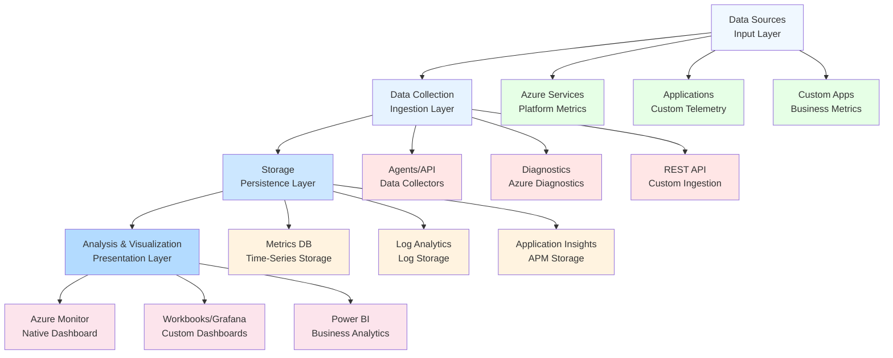

# Azure Monitoring & Governance Decision Guide

## 🎯 Quick Overview

| <div style="text-align: center">Service</div> | <div style="text-align: center">Purpose</div> | <div style="text-align: center">Use Case</div> | <div style="text-align: center">Data Retention</div> | <div style="text-align: center">Cost</div> |
|---------|---------|----------|----------------|------|
| **Azure Monitor** | Unified monitoring | Metrics, logs, alerts | 93 days (metrics) | €€ |
| **Log Analytics** | Log collection & analysis | Centralized logging | Configurable | €€€ |
| **Application Insights** | APM | Application performance | 730 days | €€ |
| **Azure Policy** | Governance | Compliance, standards | N/A | Free |
| **Cost Management** | FinOps | Cost tracking, optimization | 13 months | Free |
| **Resource Graph** | Resource query | Asset inventory | Real-time | Free |
| **Azure Advisor** | Recommendations | Best practices | N/A | Free |

---

## 📊 Azure Monitor - Unified Observability Platform

### 🎯 When to Use Azure Monitor
- ✅ **Centralized monitoring** across all Azure services
- ✅ **Custom metrics** from applications
- ✅ **Alerting and notifications** for operational issues
- ✅ **Performance monitoring** and troubleshooting
- ✅ **Compliance** and audit trail requirements

### **Data Types and Sources**
```
Metrics (Time-series):
├── Platform metrics (automatic)
├── Guest OS metrics (agent required)
├── Application metrics (custom)
└── Custom metrics (REST API)

Logs (Text-based):
├── Activity logs (Azure operations)
├── Resource logs (service-specific)
├── Application logs (custom)
└── Guest OS logs (agent required)
```

### **Monitoring Architecture**


### **Key Features**
- **Metrics Explorer:** Interactive metric analysis
- **Log Analytics:** KQL-based log querying
- **Alerts:** Proactive notification system
- **Workbooks:** Interactive reporting
- **Action Groups:** Automated responses

---

## 📝 Log Analytics - Centralized Logging

### 🎯 When to Use Log Analytics
- ✅ **Centralized log** aggregation
- ✅ **Complex log** analysis with KQL
- ✅ **Long-term log** retention
- ✅ **Security monitoring** with Sentinel
- ✅ **Cross-resource** correlation

### **Workspace Design Strategy**
```
Single Workspace (Recommended):
- Centralized governance
- Cross-resource correlation
- Simplified RBAC management
- Cost optimization

Multiple Workspaces (When needed):
- Regulatory isolation requirements
- Geographic data residency
- Different retention needs
- Separate billing requirements
```

### **Data Ingestion Methods**
| <div style="text-align: center">Method</div> | <div style="text-align: center">Use Case</div> | <div style="text-align: center">Cost Impact</div> |
|--------|----------|-------------|
| **Diagnostic Settings** | Azure resource logs | Standard |
| **Agents** | VM/server logs | Standard |
| **Data Collector API** | Custom applications | Standard |
| **Logic Apps** | Third-party integration | Additional compute |

### **KQL Query Examples**
```kql
// Top 10 error events in last 24 hours
Event
| where TimeGenerated > ago(24h)
| where EventLevelName == "Error"
| summarize count() by Source
| top 10 by count_

// Application performance over time
AppRequests
| where TimeGenerated > ago(7d)
| summarize avg(DurationMs) by bin(TimeGenerated, 1h)
| render timechart
```

---

## 📱 Application Insights - Application Performance Monitoring

### 🎯 When to Use Application Insights
- ✅ **Application performance** monitoring
- ✅ **User behavior** analytics
- ✅ **Dependency tracking** and mapping
- ✅ **Exception and error** monitoring
- ✅ **Custom telemetry** for business metrics

### **Integration Methods**
```
Code-based:
- SDK integration (.NET, Java, Node.js, Python)
- Custom telemetry and business metrics
- Detailed dependency tracking

Codeless:
- Auto-instrumentation for supported platforms
- Minimal configuration required
- Basic telemetry collection
```

### **Key Telemetry Types**
| <div style="text-align: center">Type</div> | <div style="text-align: center">Description</div> | <div style="text-align: center">Use Case</div> |
|------|-------------|----------|
| **Requests** | HTTP requests | Performance monitoring |
| **Dependencies** | External calls | Service mapping |
| **Exceptions** | Unhandled errors | Error tracking |
| **Custom Events** | Business events | User analytics |
| **Page Views** | Client-side tracking | User experience |

### **Performance Monitoring Features**
- **Live Metrics:** Real-time monitoring
- **Application Map:** Visual dependency mapping
- **Performance Counters:** System metrics
- **Profiler:** Code-level performance analysis
- **Snapshot Debugger:** Production debugging

---

## 🛡️ Azure Policy - Governance and Compliance

### 🎯 When to Use Azure Policy
- ✅ **Enforce organizational** standards
- ✅ **Regulatory compliance** requirements
- ✅ **Resource consistency** across subscriptions
- ✅ **Cost governance** controls
- ✅ **Security baseline** enforcement

### **Policy Components**
```
Policy Definition:
├── Rules (what to evaluate)
├── Effects (what action to take)
└── Parameters (customization)

Policy Assignment:
├── Scope (subscription, resource group)
├── Parameters (specific values)
└── Exclusions (exceptions)

Initiative (Policy Set):
├── Multiple related policies
└── Simplified assignment and management
```

### **Common Policy Effects**
| <div style="text-align: center">Effect</div> | <div style="text-align: center">Description</div> | <div style="text-align: center">Use Case</div> |
|--------|-------------|----------|
| **Deny** | Block non-compliant resources | Enforce standards |
| **Audit** | Log non-compliant resources | Compliance reporting |
| **Append** | Add properties to resources | Tagging enforcement |
| **Modify** | Change resource properties | Auto-remediation |
| **DeployIfNotExists** | Deploy additional resources | Security baselines |

### **Built-in Policy Examples**
```
Security:
- Require encryption for storage accounts
- Deny public IP assignments
- Enforce HTTPS for web apps

Cost Management:
- Restrict VM sizes by location
- Require resource tags
- Limit expensive resource types

Compliance:
- ISO 27001 compliance baseline
- HIPAA compliance controls
- Azure Security Benchmark
```

---

## 💰 Cost Management + Billing - FinOps Implementation

### 🎯 When to Use Cost Management
- ✅ **Cost visibility** and tracking
- ✅ **Budget management** and alerts
- ✅ **Cost optimization** recommendations
- ✅ **Chargeback and showback** scenarios
- ✅ **FinOps practices** implementation

### **Cost Analysis Features**
```
Views:
├── Actual costs (historical spending)
├── Forecasted costs (predicted spending)
├── Amortized costs (reservation spreading)
└── Blended costs (hybrid scenarios)

Grouping:
├── By subscription, resource group
├── By service type, location
├── By tags (department, project)
└── By reservation utilization
```

### **Budget Configuration**
| <div style="text-align: center">Budget Type</div> | <div style="text-align: center">Trigger</div> | <div style="text-align: center">Action</div> |
|-------------|---------|--------|
| **Cost Budget** | Actual spending | Email alert, webhook |
| **Usage Budget** | Resource consumption | Action group notification |
| **Forecast Budget** | Predicted spending | Proactive alerting |

### **FinOps Practices Integration**
```
Inform Phase:
- Cost allocation through tagging
- Showback reports for teams
- Regular cost reviews

Optimize Phase:
- Right-sizing recommendations
- Reserved instance planning
- Unused resource cleanup

Operate Phase:
- Automated governance policies
- Continuous optimization
- Cultural integration
```

---

## 🔍 Azure Resource Graph - Asset Management

### 🎯 When to Use Resource Graph
- ✅ **Resource inventory** and discovery
- ✅ **Compliance reporting** across subscriptions
- ✅ **Security assessments** at scale
- ✅ **Cost analysis** and optimization
- ✅ **Change tracking** and auditing

### **Query Capabilities**
```kql
// Find all VMs without backup enabled
Resources
| where type == "microsoft.compute/virtualmachines"
| join kind=leftouter (
    RecoveryServicesResources
    | where type == "microsoft.recoveryservices/vaults/backupfabrics/protectioncontainers/protecteditems"
    | parse id with * "/microsoft.compute/virtualmachines/" vmName
    | project vmName
) on $left.name == $right.vmName
| where isempty(vmName1)
| project name, resourceGroup, location
```

### **Integration Points**
- **Azure Policy:** Compliance reporting
- **Azure Advisor:** Resource optimization
- **Security Center:** Security posture
- **Cost Management:** Resource costing
- **Azure Automation:** Remediation workflows

---

## 🎯 Monitoring Strategy by Workload

### **Web Applications**
```
Monitoring Stack:
├── Application Insights (APM)
├── Log Analytics (Infrastructure logs)
├── Azure Monitor (Platform metrics)
└── Availability tests (Uptime monitoring)

Key Metrics:
- Response time, throughput
- Error rate, availability
- User satisfaction (Apdex)
- Business metrics (conversions)
```

### **Microservices Architecture**
```
Distributed Tracing:
├── Application Insights correlation
├── Service map visualization
├── Dependency performance tracking
└── Cross-service error propagation

Container Monitoring:
├── Container Insights (AKS/ACI)
├── Prometheus metrics collection
├── Custom application metrics
└── Infrastructure resource monitoring
```

### **Data Platforms**
```
Database Monitoring:
├── SQL Analytics (Azure SQL)
├── Cosmos DB Insights
├── Performance recommendations
└── Query performance insights

Data Pipeline Monitoring:
├── Data Factory monitoring
├── Synapse Analytics insights
├── Stream Analytics metrics
└── Event Hub metrics
```

### **Infrastructure Services**
```
Infrastructure Monitoring:
├── VM Insights (guest OS monitoring)
├── Network Insights (connectivity)
├── Storage Analytics (performance)
└── Security Center (compliance)

Automation and Alerts:
├── Runbook automation
├── Auto-scaling triggers
├── Incident response workflows
└── Preventive maintenance
```

---

## 🚨 Alerting and Incident Response

### **Alert Types and Use Cases**
| <div style="text-align: center">Alert Type</div> | <div style="text-align: center">Trigger</div> | <div style="text-align: center">Use Case</div> |
|------------|---------|----------|
| **Metric Alerts** | Threshold breaches | Performance monitoring |
| **Log Alerts** | Log query results | Error detection |
| **Activity Log Alerts** | Azure operations | Security monitoring |
| **Smart Detection** | Anomaly detection | Proactive alerting |

### **Alert Processing Rules**
```
Suppression:
- Maintenance windows
- Known issues
- Testing periods

Routing:
- Severity-based routing
- Team-specific alerts
- Escalation procedures

Enrichment:
- Additional context
- Runbook links
- Troubleshooting guides
```

### **Action Groups Configuration**
```
Notification Actions:
├── Email, SMS, voice calls
├── Push notifications (mobile app)
├── Webhook integrations
└── ITSM connector (ServiceNow)

Automation Actions:
├── Azure Functions
├── Logic Apps workflows
├── Automation runbooks
└── Auto-scaling triggers
```

---

## 📈 Governance Maturity Model

### **Level 1: Reactive**
```
Characteristics:
- Basic monitoring and alerting
- Manual cost reviews
- Ad-hoc policy enforcement
- Limited visibility

Focus Areas:
- Implement basic monitoring
- Set up cost budgets
- Deploy essential policies
```

### **Level 2: Proactive**
```
Characteristics:
- Comprehensive monitoring strategy
- Regular cost optimization
- Systematic policy enforcement
- Cross-team visibility

Focus Areas:
- Advanced analytics and dashboards
- Automated cost governance
- Compliance frameworks
```

### **Level 3: Predictive**
```
Characteristics:
- AI-powered insights
- Automated optimization
- Self-healing systems
- Business-aligned metrics

Focus Areas:
- Machine learning integration
- Predictive cost modeling
- Automated remediation
```

---

## 💡 Best Practices and Recommendations

### **Monitoring Design Principles**
```
1. Monitor what matters: Focus on business impact
2. Design for scale: Consider data volume growth
3. Automate responses: Reduce manual intervention
4. Practice observability: Logs, metrics, traces
5. Align with SLAs: Monitor user experience
```

### **Cost Optimization Strategies**
```
1. Implement consistent tagging strategy
2. Regular right-sizing reviews
3. Reserved capacity planning
4. Automated cleanup policies
5. Cross-team cost accountability
```

### **Governance Implementation**
```
1. Start with high-impact policies
2. Implement gradually across environments
3. Monitor compliance continuously
4. Regular policy reviews and updates
5. Stakeholder communication and training
```

---

*Effective monitoring and governance enable sustainable cloud operations and business value.*
